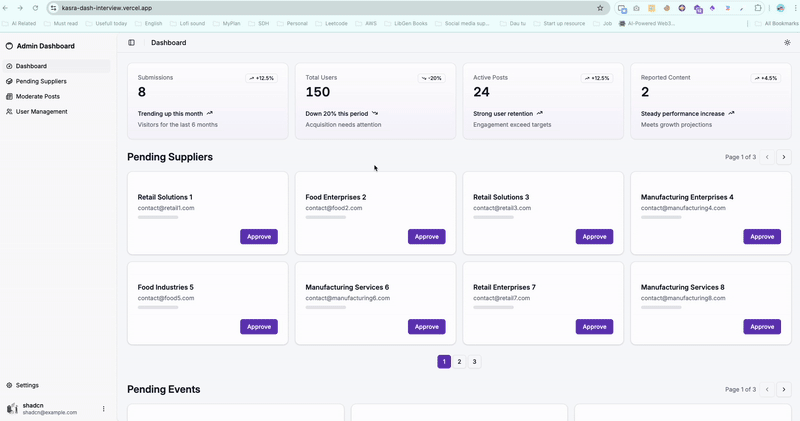

# KasraDash_Test

This project is a simple dashboard for KasraDash interview test.

# Deployment
I have deployed the project on Vercel: https://kasra-dash-interview.vercel.app/

# Setup run project locally
## 1. Prerequisites

- Node.js version 22.13.1
- pnpm version 10.8.1

## 2. How to run the project

1. Ensure you have the correct versions of Node.js and pnpm installed.
2. Clone the repository to your local machine.
3. Navigate to the project directory.
4. Run `pnpm install` to install the project dependencies.
5. Run `pnpm dev` to start the project.
6. Go to `http://localhost:5173` to view the project.

## 3.   Assumptions and Shortcuts

- I assumed that the project is a single page application.

## 4. Tech Choices and Reasoning

- I chose to use React Router for the routing.
- I chose to use Tailwind CSS for the styling.
- I chose to use Shadcn UI for the components.
- I chose to use Zustand for the state management.
- I chose to use React Hook Form for the form handling.

==The tech stack above includes React Router for efficient routing, Tailwind CSS for utility-first styling, and Shadcn UI for  Design components. Zustand is used for lightweight state management, and React Hook Form for performant form handling. These tools provide a balance of productivity, performance, and maintainability, and are well-documented and widely used, ensuring reliability and ease of finding resources.==

### 5. Showcase of the project

